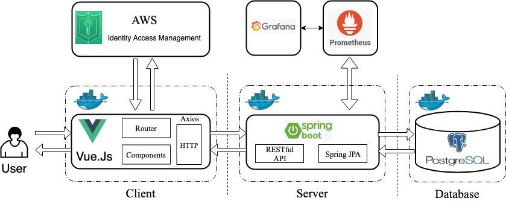
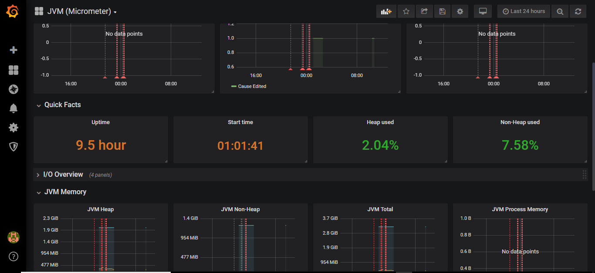
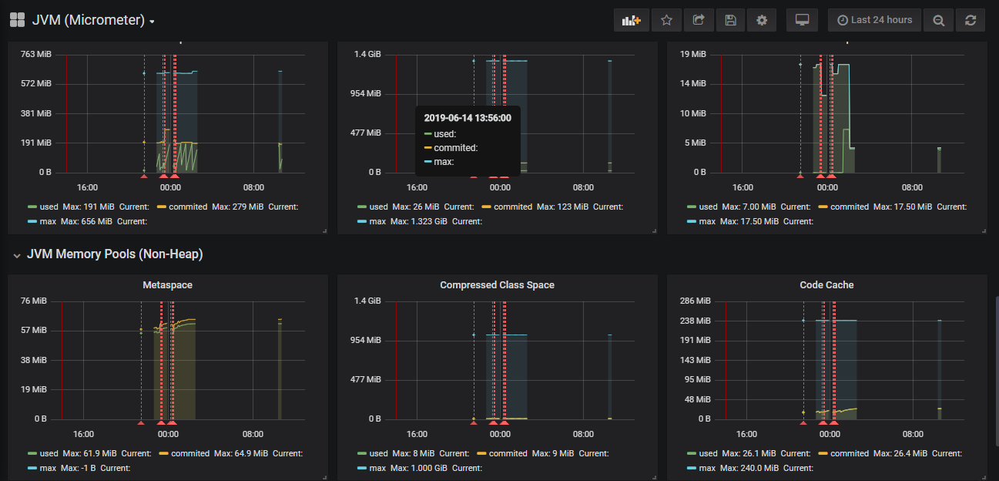

# Fund Raiser – A Helping hand 

## About Fund Raiser:

> This Application can be used for Non-Profit Organization as a platform where People suffering from Personal Cause or Medical Cause or Victims of Natural Calamities can be provided with a helping hand. Cause can be created by Admin once after confirming the cause from the victim personally and then people can contribute by donating money for the cause.

## Team 10:

Ashish Chouhan (11010876)			Hitesh Chaudhari (11011760) 
Nikhil Gaikwad (11010865) 		Paneesh Prabhuraj (11010866)
Sanket Nipane (11010856)

---

## Architecture:

The project is divided into following stages as shown in Figure 1:

1.	Client:		          VueJs
2.	Server:		          Springboot
3.	Database:		        PostgreSQL
4.	Authentication: 	  Amazon Web Service IAM
5.	Server Monitoring: 	Prometheus (In memory DB), Grafana (Data visualization)

                                    Figure 1. Fund Raiser Architecture Diagram

## Functionalities provided by Fund Raiser are as follows:

1. Browse All the Cause created by Admin  => *Accessible to Admin, Registered User and Unregistered User.*
2. Details about the Cause                => *Accessible to Admin, Registered and Unregistered User.*
3. Register a User                        => *Using AWS IAM. (AWS IAM provide the user credential management where loginId and                                               password is stored at AWS server and when the user login into the system, the                                                 credentials are verified at AWS side. We are not storing the password of the                                                   user in postgres)*
4. Login into the application             => *Using AWS IAM (After Login JWT Token is generated by AWS and provided to the                                                   application, this token is saved during login in Postgres in front of the user                                                 id till the time user is logged in and all communication here after is handled                                                 by JWT token. Once User Logged Out, the token is deleted from the Postgres                                                     table. In this way user can logged in to the system with different devices.)* 
5. Create a Cause                         => *Accessible to Admin.*
6. Update a Cause                         => *Accessible to Admin.*
7. Donate for the Cause                   => *Accessible to Admin and Registered User.*
8. Deactivate the Cause:
   * Scenario 1: When targeted amount is reached. (Handled at Run Time, when user is transferring the                  amount)
   * Scenario 2: When Expiration Date is reached. (Handled with a Spring boot schedular job)

## Environment Setup for Fund Raiser Application:

Important: Clone the GitHub repository sad_2019_3_team_10

* **Client Setup:**
    1. Install Node Js
    2. Navigate inside the Client directory: `cd sad_2019_3_team-10/Client`
    3. Execute command: `npm install`

* **Server Setup:**
    1. Install Java 8.0
    2. Setup Environment variable for JAVA_HOME.

* **Database Setup:**
    1. Install Postgres:10 (With user Id = `postgres` and password = `postgres`, If ID and password are different, Please            update them in application.properties file in the Server folder).
    2. Create a Database by Name “fundraiser” in the database
    3. Right Click on the Database and import the tar provided by name fundraiser.

* **Monitoring system:**
  * **Prometheus:**
    1. Install Prometheus.
    2. Replace existing Prometheus.yml file with this. (attach a file here Prometheus.yml)
    3. Execute the application with Prometheus.exe. 

  * **Grafana:**
    1. Install Grafana.
    2. Replace the file in /data/Grafana.db with the file present in the root folder by name Grafana.db
    3. Execute the application with Grafana-server.exe and login with username: admin and password: admin.
    4. Open dashboard with name ‘JVM (micrometer)’.

## Execution of Application:
**Note: We tried with deploying the application on Docker. Docker file for Client is present in Client folder, docker file       for Server is present in Server folder and docker-compose file is present in the root folder. But we were able to spin up     the Postgres image and Server image through docker-compose but Client image is having issue. Therefore, only docker files     are provided and steps are not mentioned to spin up the docker containers.**
1. Start Postgres and Connect to the fundraiser database.
2. Start the Server:
    1. Navigate to the target folder present in Server folder: `cd sad_2019_3_team-10/Server/target`
    2. Execute command: `java -jar fundraiser.jar`
    3. Server will start at http://localhost:8085
3. Start the Client:
    1. Navigate to the Client directory: `cd sad_2019_3_team-10/Client`
    2. Execute command: `npm run dev`
    3. Client will start at http://localhost:8080

Kindly refer Figure 2 and Figure 3 for screenshots showing the Server-side monitoring with the help of Grafana and Prometheus:

                                    Figure 2. Grafana Monitor Dashboard 
                                    

                                    Figure 3. Grafana Monitor Dashboard
---

### Acknowledgment: We would like to thank Mr. Christoph Hahn and Dr. Andreas Jäger for giving us the freedom to opt for any technology and develop the project that we could relate this in terms of purpose and use. ###

---

